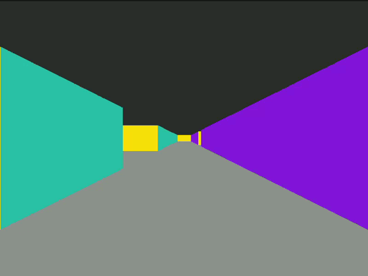

<!-- ahokcool HEADER START-->
---
<a id="top"></a>
<div align="center">
  <a href="https://github.com/ahokcool/ahokcool/blob/main/README.md">
    
  </a><br>
An overview of all my projects can be found here: <a href="https://github.com/ahokcool/ahokcool/blob/main/README.md" target="_blank">ahokcool</a><br><br>
  <a href="https://www.42lisboa.com">
    
  </a><br>
  This project was created as part of my studies at: <a href="https://www.42lisboa.com" target="_blank">42 Lisboa</a><br>
  This project is a group project with 
	<a href="https://github.com/AshParker19" target="_blank">ashParker19</a>,
	<a href="https://github.com/joaodibba" target="_blank">joaodibba</a> &
	<a href="https://github.com/rajh-phuyal" target="_blank">rajh-phuyal</a><br>
</div>

---
<!-- ahokcool HEADER END-->
<!-- PROJECT HEADER START -->
<br />
<div align="center">
  <a href="./">
    
  </a>
  <h1 align="center">cub3D</h1>
<p align="center">
    creating a 3D game in C using raycasting
</p>
</div>
<br>
<!-- PROJECT HEADER END -->

## :bulb: Lessons learned
- the software design pattern [model–view–controller](Model–view–controller)
- [digital differential analyzer](https://en.wikipedia.org/wiki/Digital_differential_analyzer_(graphics_algorithm)) (graphics algorithm)
- vector handling including: addition, rotation, normalisation
- calculation of perpendicular and euclidean distances

## Installation
```
$ git clone --recurse-submodules https://github.com/ahokcool/cub3D.git    # Clone
$ cd cub3D                                                                # Change directory
$ make                                                                    # Compile
$ ./cub3D <map_file.cub>                                                  # Run
```
## Features

<div align="center">
	<a href="./">
		
	</a>
	<p align="center">
		<b>move with <code>a</code>,<code>d</code>,<code>w</code>,<code>s</code>;</b> turn with <b><code>q</code>,<code>e</code></b> (or arrow keys)
	</p>
</div>

---

<div align="center">
	<a href="./">
		
	</a>
	<p align="center">
		<b>switch between 3D and 2D view by pressing keys <code>2</code> and <code>3</code>.</b>
	</p>
</div>

---

<div align="center">
	<a href="./">
		
	</a>
	<p align="center">
		<b>toggle between coloured and textured walls by pressing <code>t</code></b>
	</p>
</div>

---

<div align="center">
	<a href="./">
		
	</a>
	<p align="center">
		<b>change the field of view (fov) using the mouse wheel</b>
	</p>
</div>

<!-- ahokcool FOOTER-->
---
<p align="center">
  <a href="#top">🔝 back to top 🔝</a>
</p>
